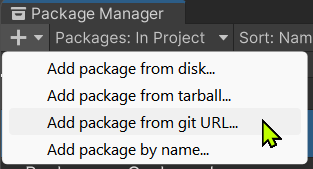
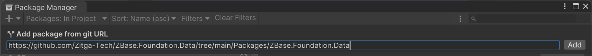
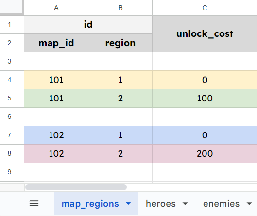
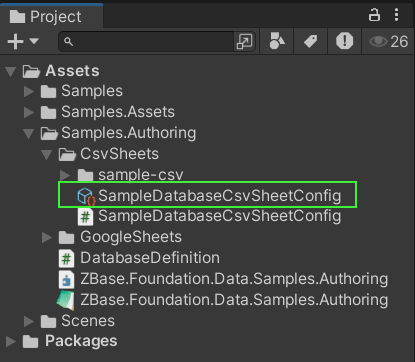
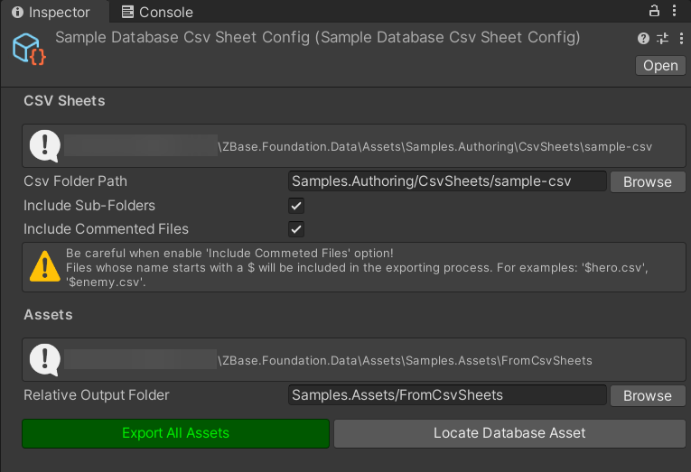
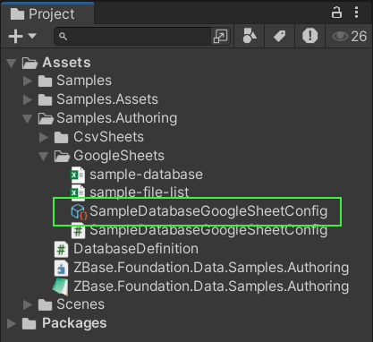
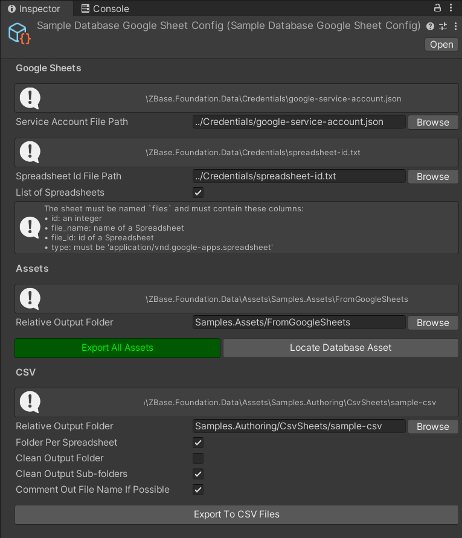

# ZBase.Foundation.Data

A code-first data management workflow for C# and Unity, powered by [BakingSheet](https://www.github.com/cathei/BakingSheet) and [Source Generators](https://docs.microsoft.com/en-us/dotnet/csharp/roslyn-sdk/source-generators-overview).

## Features

- Clear separation between runtime data models and authoring data sources.
    - Authoring code, data sources and configuration will NOT be included in the build.
- Data sources can be Google Sheets or CSV files (powered by BakingSheet).
- Support for complex data types (powered by BakingSheet).
    - There are only a few [Limitations](#limitations).
- Automatic mapping between data sources and data models (powered by Source Generators).
- Code-first approach with minimal configuration on Unity Inspector.
- Flexible and automatic data type conversion mechanism.

## Installation

### Requirements

- Unity 2022.3 or later

### Unity Package Manager

1. Open menu `Window` -> `Package Manager`.
2. Click the `+` button at the top-left corner, then choose `Add package from git URL...`.

    

3. Enter the package URL `https://github.com/Zitga-Tech/ZBase.Foundation.Data/tree/main/Packages/ZBase.Foundation.Data`.



### OpenUPM

1. Install [OpenUPM CLI](https://openupm.com/docs/getting-started.html#installing-openupm-cli).
2. Run the following command in your Unity project root directory:

```sh
openupm add com.zbase.foundation.data
```

## General Workflow

At high level, the usage workflow usually consists of the following steps:
1. **Data Authoring**: Create data sources in Google Sheets or CSV files.
2. **Data Modeling**: Design `IData` models in C# code along with the table assets to store them.
3. **Data Importing**: Leverage **BakingSheet** to import authored data from step 1 into each corresponding table asset. This step requires a piece of bridging code and a config asset.

## Tutorial

For this tutorial:
- Data sources are defined in [Google Sheets](https://docs.google.com/spreadsheets/d/19BtCJ6GqEE0rKCVFcfgX8-rjLdPTK8KQbE7gHonjdJ4/edit?usp=sharing)
- Data models and table assets located at [Assets/Samples](./Assets/Samples/)
- Data importing configs located at [Assets/Samples.Authoring](./Assets/Samples.Authoring/)

### Step 1. Data Authoring

#### 1.1. Create Data Sources

Data sources can be either Google Sheets or CSV files.

<picture id="fig_1">
  <source media="(prefers-color-scheme: dark)" srcset="imgs/table-map-regions-dark.png">
  <source media="(prefers-color-scheme: light)" srcset="imgs/table-map-regions-light.png">
  
</picture>

**Figure 1:** [`map_regions` table](https://docs.google.com/spreadsheets/d/19BtCJ6GqEE0rKCVFcfgX8-rjLdPTK8KQbE7gHonjdJ4/edit?gid=1055644696#gid=1055644696)

#### 1.2. Use a Consistent Naming Strategy

You must choose one of these strategies and apply it consistently for all sheets, columns, and CSV files.

| Pascal        | Camel         | Snake          | Kebab          |
| ------------- | ------------- | -------------- | -------------- |
| `SheetName`   | `sheetName`   | `sheet_name`   | `sheet-name`   |
| `ColumnName`  | `columnName`  | `column_name`  | `column-name`  |
| `FileName.csv`| `fileName.csv`| `file_name.csv`| `file-name.csv`|

### Step 2. Data Modeling

#### 2.1. Define Data Models

- Define a data model, can be `struct` or `class`, and **must** implement `IData` interface.
- Any field that should be mapped to a column in the data source must be decorated with `[SerializeField]`.
    - A public property will be generated for such valid fields.
- In case you prefer writing properties, each should be decorated with `[DataProperty]`.
    - The underlying field and methods will be generated for such valid properties.
- The data model **must** be `partial` so that source generators can generate the underlying implementation.
- Fields or properties are matched to columns in the data source by name, after applying the naming strategy.
- The ID of a data model can be a complex structure, consists of multiple fields.
    - These field named `_id` or `id` or the property named `Id` will be recognized as the ID of that model.

<br/>

<p id="list_1"><b>Listing 1:</b> Model for the ID of a map region entry</p>

```csharp
public partial struct MapRegionIdData : IData
{
    [SerializeField]
    private int _mapId;

    [SerializeField]
    private int _region;

    // IData source generator will generate
    // a property for each field.
    // ===

    // public int MapId { get => _mapId; init => _mapId = value; }

    // public int Region { get => _region; init => _region = value; }
}
```

<p id="list_2"><b>Listing 2:</b> Model for the map region entry</p>

```cs
public partial class MapRegionData : IData
{
    [DataProperty]
    public MapRegionIdData Id => Get_Id();

    [DataProperty]
    public int UnlockCost => Get_UnlockCost();

    // IData source generator will generate
    // a field and a `Get_XXX()` method for each property.
    // ===

    // [SerializeField]
    // private MapRegionIdData _id;

    // private readonly MapRegionIdData Get_Id() => _id;

    // [SerializeField]
    // private int _unlockCost;

    // private readonly int Get_UnlockCost() => _unlockCost;
}
```

#### 2.2. Define Data Table Assets

- Each data table asset type should inherit from either `DataTableAsset<TEntryId, TEntry>` or `DataTableAsset<TEntryId, TEntry, TConvertedId>`.
    - `TEntryId` is the type of the `Id` property of `TEntry`.
    - `TEntry` is the data model, corresponding to a row in the data source.
    - `TConvertedId` is the type of the `Id` property of `TEntry` after being converted from `TEntryId`.
- It is **required** to implement `IDataTableAsset` interface so source generator can generate additional but necessary code.
- Ultimately this is a `ScriptableObject` to store the imported data.

<p id="list_3"><b>Listing 3:</b> Data table asset for map region</p>

```cs
public sealed partial class MapRegionDataTableAsset
    : DataTableAsset<MapRegionIdData, MapRegionData, MapRegionId>
    , IDataTableAsset
{
    protected override MapRegionId Convert(MapRegionIdData value)
        => value;

    // IDataTableAsset source generator will generate
    // a constant field `NAME` and a `GetId()` method.
    // ===

    // public const string NAME = nameof(MapRegionDataTableAsset);

    // protected override MapRegionIdData GetId(in MapRegionData data)
    // {
    //     return data.Id;
    // }
}
```

### Step 3. Data Importing

#### 3.1. Declare a Bridge to BakingSheet

- Define a partial class of any name.
    - Decorate the class with `[Database]` attribute.
    - Can specify a global naming strategy for all tables.
- Inside the class, define a property for each table asset. Each will be mapped to a sheet in the data source.
    - Decorate the property with `[Table]` attribute.
- In case a column in the data source should be a [vertical list](https://github.com/cathei/BakingSheet?tab=readme-ov-file#using-row-array), decorate the property with `[VerticalList]` attribute.
    - First parameter of the attribute is the type of the data model, which can be a part of the table, not necessary the main data model.
    - Second parameter is the name of the property that should be treated as a vertical list.

<p id="list_4"><b>Listing 4:</b> A bridge to map each table to its source sheet</p>

```cs
[Database(NamingStrategy.SnakeCase)]
public partial class DatabaseDefinition
{
    [Table] public MapRegionDataTableAsset MapRegions { get; }

    [VerticalList(typeof(HeroData), nameof(HeroData.Multipliers))]
    [Table] public HeroDataTableAsset Heroes { get; }
}
```

After defining the bridge, BakingSheet related code will be generated so that data importing can function.

#### 3.2. Import From Data Source

There are 2 ways to implement this functionality:
1. Create an asset for `DatabaseCsvSheetConfig` and use its Inspector functionality ([Appendix A](#appendix-a-import-data-via-a-configuration-asset)).
2. Write a function to import the data source ([Appendix B](#appendix-b-import-data-via-a-function)).

## Appendices

### Appendix A. Import data via a configuration asset

#### A.1. CSV

1. Define a class that inherits from `DatabaseCsvSheetConfig`.

    ```cs
    [CreateAssetMenu(
          fileName = nameof(SampleDatabaseCsvSheetConfig)
        , menuName = "Sample Database Csv Sheet Config"
        , order = 0
    )]
    public partial class SampleDatabaseCsvSheetConfig
        : DatabaseCsvSheetConfig<DatabaseDefinition.SheetContainer>
        //                       ^^^^^^^^^^^^^^^^^^
        //        Replace this with your class defined at step 3.1.
    {
        protected override DatabaseDefinition.SheetContainer CreateSheetContainer()
        {
            return new DatabaseDefinition.SheetContainer(UnityLogger.Default);
            //         ^^^^^^^^^^^^^^^^^^
            // Replace this with your class defined at step 3.1.
        }

        protected override string GetDatabaseAssetName()
        {
            // Any name of your choice.
            return "SampleDatabaseAsset";
        }
    }
    ```

2. In the **Project** window, create an asset out of it.

    

3. Fill in the fields in the Inspector. Then click the `Export All Assets` button.

    

#### A.2. Google Sheets

1. Define a class that inherits from `DatabaseGoogleSheetConfig`.

    ```cs
    [CreateAssetMenu(
          fileName = nameof(SampleDatabaseGoogleSheetConfig)
        , menuName = "Sample Database Google Sheet Config"
        , order = 0
    )]
    public partial class SampleDatabaseGoogleSheetConfig
        : DatabaseGoogleSheetConfig<DatabaseDefinition.SheetContainer>
        //                          ^^^^^^^^^^^^^^^^^^
        //           Replace this with your class defined at step 3.1.
    {
        protected override DatabaseDefinition.SheetContainer CreateSheetContainer()
        {
            return new DatabaseDefinition.SheetContainer(UnityLogger.Default);
            //         ^^^^^^^^^^^^^^^^^^
            // Replace this with your class defined at step 3.1.
        }

        protected override string GetDatabaseAssetName()
        {
            // Any name of your choice.
            return "SampleDatabaseAsset";
        }
    }
    ```

2. In the **Project** window, create an asset out of it.

    

3. Follow this [tutorial](https://github.com/cathei/BakingSheet/blob/master/docs/google-sheet-import.md) to properly configure the Spreadsheet so it can be imported. It also explains how to acquire the ID of a spreadsheet, and the Google Credential JSON.

4. Fill in the fields in the Inspector. Then click the `Export All Assets` button.

    

### Appendix B. Import data via a function

#### B.1. CSV

```cs
using System;
using System.Threading.Tasks;
using Cathei.BakingSheet.Unity;
using UnityEditor;
using ZBase.Foundation.Data.Authoring;

public static partial class DatabaseImporter
{
    public static async Task<bool> FromCsvFilesAsync(
          string csvFolderPath
        , string assetOutputFolderPath
        , bool includeSubFolders = true
        , bool includeCommentedFiles = true
    )
    {
        var converter = new DatabaseCsvSheetConverter(
              csvFolderPath
            , TimeZoneInfo.Utc
            , includeSubFolders: includeSubFolders
            , includeCommentedFiles: includeCommentedFiles
        );

        var sheetContainer = new DatabaseDefinition.SheetContainer(UnityLogger.Default);
        //                       ^^^^^^^^^^^^^^^^^^
        //        Replace this with your class defined at step 3.1.

        var result = await sheetContainer.Bake(converter).ConfigureAwait(true);

        if (result == false)
        {
            return false;
        }

        var exporter = new DatabaseAssetExporter<DatabaseAsset>(
              assetOutputFolderPath
            , nameof(DatabaseAsset)
        );

        result = await sheetContainer.Store(exporter).ConfigureAwait(true);

        if (result == false)
        {
            return false;
        }

        AssetDatabase.Refresh();
        return true;
    }
}
```

#### B.2. Google Sheets

**Note:** Follow this [tutorial](https://github.com/cathei/BakingSheet/blob/master/docs/google-sheet-import.md) to properly configure the Spreadsheet so it can be imported. It also explains how to acquire the ID of a spreadsheet, and the Google Credential JSON.

```cs
using System;
using System.IO;
using System.Threading.Tasks;
using Cathei.BakingSheet.Unity;
using UnityEditor;
using ZBase.Foundation.Data.Authoring;

public static partial class DatabaseImporter
{
    public static async Task<bool> FromGoogleSheetsAsync(
          string spreadsheetId
        , string googleCredentialJson
        , string assetOutputFolderPath
    )
    {
        var converter = new DatabaseGoogleSheetConverter(
              spreadsheetId
            , googleCredentialJson
            , TimeZoneInfo.Utc
        );

        var sheetContainer = new DatabaseDefinition.SheetContainer(UnityLogger.Default);
        //                       ^^^^^^^^^^^^^^^^^^
        //        Replace this with your class defined at step 3.1.

        var result = await sheetContainer.Bake(converter).ConfigureAwait(true);

        if (result == false)
        {
            return false;
        }

        var exporter = new DatabaseAssetExporter<DatabaseAsset>(
              assetOutputFolderPath
            , nameof(DatabaseAsset)
        );

        result = await sheetContainer.Store(exporter).ConfigureAwait(true);

        if (result == false)
        {
            return false;
        }

        AssetDatabase.Refresh();
        return true;
    }
}
```

#### B.3. Excel

**[WIP]**

## Limitations

- Nested vertical list is [not supported](https://github.com/cathei/BakingSheet/issues/36).
- [Cross-Sheet Reference](https://github.com/cathei/BakingSheet?tab=readme-ov-file#using-cross-sheet-reference) is not supported.
